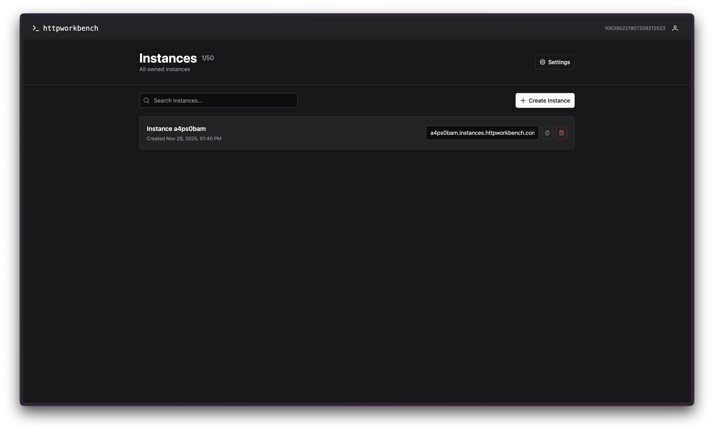
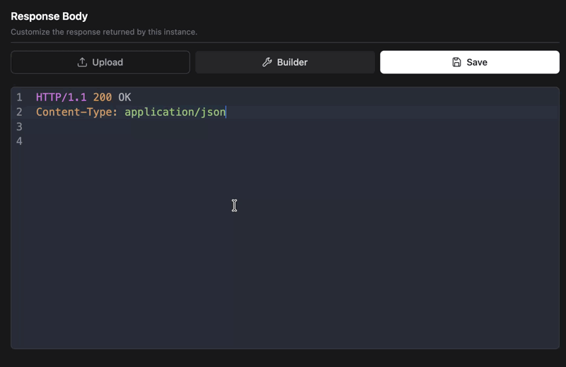

<p align="center">
  <br>
  HTTP testing platform for security researchers<br><br>
  
  
  
</p>

---

HTTP Workbench is a platform for testing HTTP requests and temporarily hosting your PoC pages.

You can use HTTP Workbench by either self-hosting it on your own server or using the hosted version at [httpworkbench.com](https://httpworkbench.com/).

This is a v2 version of `ssrf.cvssadvisor.com` which was originally meant for testing HTTP/DNS interactions for SSRF testing, but I ended up using it more for hosting quick PoC testing pages. This project is still a work in progress - once we finish all milestones in the roadmap, it will fully replace ssrf.cvssadvisor.com.

One thing stays the same: it will be as easy as before to create new instances. That's why there's a guest mode where you don't even need to create an account to get started. The main goal is to keep this tool very simple and quick to use.


<p align="center">
  
</p>

## Roadmap to v1

- [ ] Username/password authentication for self-hosted deployments
- [ ] DNS support
- [ ] better documentation
- [ ] better self host setup process
- [ ] multi-domain setup

## Roadmap after v1

- [ ] Caido plugin integration

## Features

### Tab autocompletion



### Proof of Concept Builder


## Self-Hosting

### Prerequisites

* Docker and Docker Compose
* Domain with Cloudflare DNS
* Google OAuth credentials ([setup guide](https://developers.google.com/identity/protocols/oauth2))
* Cloudflare API token with DNS permissions

### Quick Start

1. Clone the repository:

```bash
git clone https://github.com/bebiksior/httpworkbench.git
cd httpworkbench
```

2. Run the setup script:

```bash
./scripts/setup.sh
```

The script will guide you through:
- Domain configuration
- Google OAuth setup
- Cloudflare API token setup

3. Configure DNS in Cloudflare:
- Add A record: `yourdomain.com` → Your server IP
- Add A record: `*.instances.yourdomain.com` → Your server IP

4. Add Google OAuth redirect URI:
- Go to Google Cloud Console
- Add `https://yourdomain.com/api/auth/google/callback` to authorized redirect URIs

5. Start the services:

```bash
docker compose up -d --build
```

The first startup may take a few minutes to build images and provision SSL certificates.

## Your Data

HTTP Workbench stores just the basics in a simple JSON file: your Google ID for login (not the email), when you created your account, your PoC pages and webhooks, and the HTTP request logs (including IPs, headers, and request details). This is all needed for the app to work properly.

Full transparency: I never tried to access any data of users on ssrf.cvssadvisor.com, the old version didn't even have a proper database, it was all stored in the memory :D. However, it technically is possible that I can access this data. I'm happy to hear some suggestions to make this more secure for you guys, to be 100% sure that I can't access your data you can self-host this tool - that's why it's open-source.

## Contributing

Contributions are welcome! Please feel free to submit a Pull Request.

## License

MIT License - see [LICENSE](LICENSE) for details
