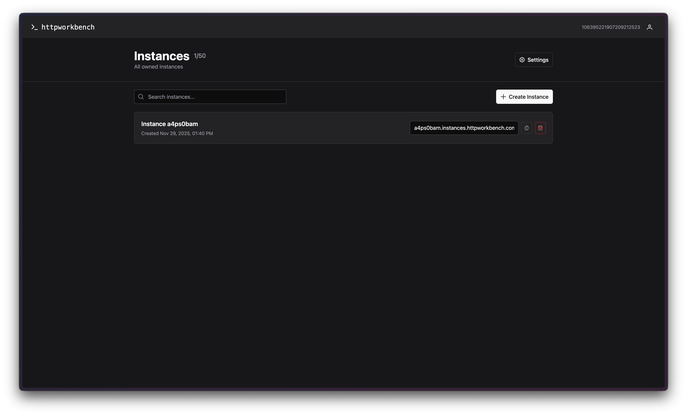
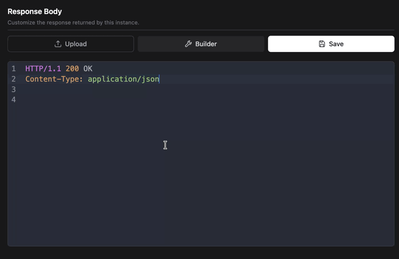

<p align="center">
  <br>
  HTTP testing platform for security researchers<br><br>
  
  
  
</p>

---

HTTP Workbench is a platform for testing HTTP requests and temporarily hosting your PoC pages.

You can use HTTP Workbench by either self-hosting it on your own server or using the hosted version at [httpworkbench.com](https://httpworkbench.com/).

This is a v2 version of `ssrf.cvssadvisor.com` which was originally meant for testing HTTP/DNS interactions for SSRF testing, but I ended up using it more for hosting quick PoC testing pages. This project is still a work in progress - once we finish all milestones in the roadmap, it will fully replace ssrf.cvssadvisor.com.

One thing stays the same: it will be as easy as before to create new instances. That's why there's a guest mode where you don't even need to create an account to get started. The main goal is to keep this tool very simple and quick to use.

> [!WARNING]
> This project is still in beta. The self-hosting setup process is not great yet and will be improved over time. Expect some rough edges and manual configuration steps.

<p align="center">
  
</p>

## Roadmap to v1

- [ ] Username/password authentication for self-hosted deployments
- [ ] DNS support
- [ ] better documentation
- [ ] better self host setup process
- [ ] multi-domain setup

## Roadmap after v1

- [ ] Caido plugin integration

## Features

### Tab autocompletion



### Proof of Concept Builder


## Self-Hosting

### Prerequisites

- Docker and Docker Compose
- Domain with Cloudflare DNS
- Google OAuth credentials ([setup guide](https://developers.google.com/identity/protocols/oauth2))
- Cloudflare API token with DNS permissions
- Optional for DNS query logging: ability to delegate a DNS subdomain and expose public UDP/TCP port 53

### Quick Start

1. Clone the repository:

```bash
git clone https://github.com/bebiksior/httpworkbench.git
cd httpworkbench
```

2. Run the setup wizard:

```bash
./scripts/setup.sh
```

You can also run it with Bun:

```bash
bun run setup
```

The wizard will:

- Domain configuration
- Google OAuth setup
- Cloudflare API token setup
- Write `.env` for you
- Show the exact DNS records to create
- Pause while you make changes
- Re-check DNS and health endpoints before moving on

3. Follow the guided steps in the wizard.

The base setup will have you create:

- `A yourdomain.com` → Your server IP
- `A *.instances.yourdomain.com` → Your server IP
- Google OAuth redirect URI: `https://yourdomain.com/api/auth/google/callback`

The wizard can start the stack for you, or you can run the compose command yourself at the end. The first startup may take a few minutes to build images and provision SSL certificates.

### Optional DNS Query Logging

DNS query logging is opt-in for self-hosted deployments. The default setup continues to work without DNS.

When `DNS_ENABLED=true`, the backend becomes authoritative for a separate delegated zone, which defaults to `dns.yourdomain.com`. Queries to `*.dns.yourdomain.com` are logged and attached to the matching instance.

If you enable DNS logging in the wizard, it will also walk you through:

- `ns1.yourdomain.com` → your server IP
- `ns2.yourdomain.com` → your server IP

- Add `NS` records for `dns.yourdomain.com`
- Point them at `ns1.yourdomain.com` and `ns2.yourdomain.com`
- Open public UDP and TCP port `53`
- Start with:

```bash
docker compose -f docker-compose.yml -f docker-compose.dns.yml up -d --build
```

ACME is unaffected by this setup because wildcard HTTPS remains on `*.instances.yourdomain.com`, while DNS logging uses a separate delegated zone and does not need TLS.

## Your Data

HTTP Workbench stores just the basics in a simple JSON file: your Google ID for login (not the email), when you created your account, your PoC pages and webhooks, and the HTTP request logs (including IPs, headers, and request details). This is all needed for the app to work properly.

Full transparency: I never tried to access any data of users on ssrf.cvssadvisor.com, the old version didn't even have a proper database, it was all stored in the memory :D. However, it technically is possible that I can access this data. I'm happy to hear some suggestions to make this more secure for you guys, to be 100% sure that I can't access your data you can self-host this tool - that's why it's open-source.

## Contributing

Contributions are welcome! Please feel free to submit a Pull Request.

## License

MIT License - see [LICENSE](LICENSE) for details
